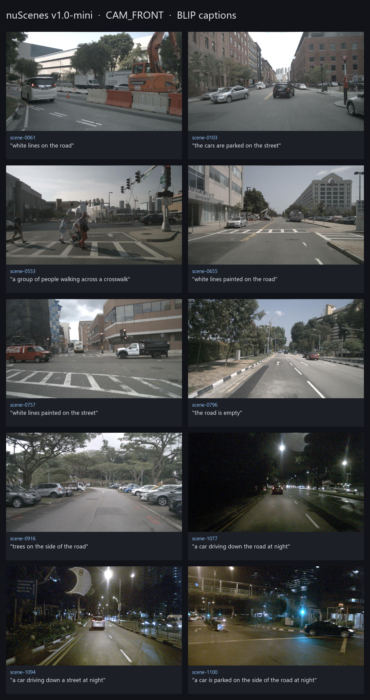
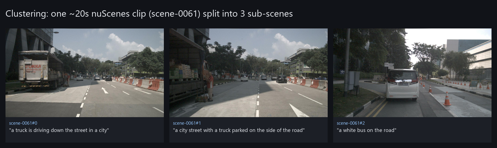

# vlm-project

> **Abstract.** `vlm-project` turns driving footage into a **searchable database of scene
> descriptions**. Point it at a set of clips — the nuScenes dataset, a folder of images, or video —
> and it uses a vision-language model to caption a representative frame of each clip (or several, if
> you enable clustering), storing every description in a local SQLite database with full-text search.
> One command ingests, another searches (*"show me scenes with pedestrians"*). It runs fully offline
> on CPU inside a container, and the database is a single portable file you can query, copy, or
> archive. Three things are configurable: the **dataset** (loader), how **keyframes** are chosen
> (single frame vs. clustering), and the **VLM backend** (local BLIP by default, or an API model).



*The image above is a genuine artifact of a real run — the actual `CAM_FRONT` keyframes of all 10
nuScenes v1.0-mini scenes with the exact BLIP captions this pipeline wrote to the database. Regenerate
it any time with `python scripts/make_readme_assets.py`.*

## What you get, on real data

A single `ingest` over nuScenes v1.0-mini produces 10 rows like these (verbatim from a real run):

| scene | BLIP description |
|---|---|
| scene-0553 | a group of people walking across a crosswalk |
| scene-1077 | a car driving down the road at night |
| scene-0103 | the cars are parked on the street |
| scene-0916 | trees on the side of the road |
| scene-0796 | the road is empty |
| scene-1100 | a car is parked on the side of the road at night |

With `--selector clusters`, a single ~20 s clip is split into a few temporally-distinct sub-scenes,
each captioned from its representative frame:



```
        your clips                         vlm-project ingest
   ┌───────────────────┐              ┌──────────────────────────────┐
   │ nuScenes          │              │ 1. load clip                 │
   │ image folder      │ ───────────▶ │ 2. select keyframe(s)        │
   │ video (.mp4)      │              │      single ▸ or ▸ clusters  │
   └───────────────────┘              │ 3. caption with VLM          │
        (configurable                 │      BLIP (CPU) ▸ or ▸ API    │
         loader)                      └──────────────┬───────────────┘
                                                     ▼
                                         ┌───────────────────────┐
                                         │      scenes.db        │
                                         │  SQLite + full-text   │
                                         └───────────┬───────────┘
                                                     │
                            vlm-project query "pedestrian"   │   copy / ship the .db,
                                     ▼                       ▼   or export-json
                             matching scenes            keep for later
```

---

## Installation & quickstart

### Option A — Docker (standalone, recommended)

Nothing to install but Docker. The image bundles the app, CPU-only PyTorch, and the BLIP weights
(baked at build time), so it runs fully offline. The dataset and outputs are mounted at run time.

```bash
# Build once (~a few minutes; downloads CPU torch + ~0.5 GB BLIP weights into the image).
docker build -t vlm-project .

# Verify the image is healthy (deps + baked weights + FTS5).
docker run --rm vlm-project doctor

# Ingest: caption a representative frame of every nuScenes scene into a searchable DB.
docker run --rm \
  -v /path/to/nuscenes:/data:ro \
  -v "$PWD/out:/out" \
  -e DATAROOT=/data -e DB=/out/scenes.db \
  vlm-project ingest -v

# Search the descriptions.
docker run --rm -v "$PWD/out:/out" -e DB=/out/scenes.db \
  vlm-project query "pedestrian crossing"

# Export to a flat JSON file if you prefer.
docker run --rm -v "$PWD/out:/out" -e DB=/out/scenes.db \
  vlm-project export-json --out /out/descriptions.json
```

`out/scenes.db` is an ordinary SQLite file — open it in any SQLite browser, copy it, or ship it.
Each command runs a job and exits; there is no server or daemon.

### Option B — local Python (for development)

```bash
python -m venv .venv && . .venv/bin/activate      # Windows: .venv\Scripts\Activate.ps1
pip install -e ".[dev]"

# Full unit suite — no dataset, no model download, runs in seconds.
pytest

# Once nuScenes v1.0-mini is under ./data:
vlm-project ingest --dataroot ./data --db ./out/scenes.db -v
vlm-project query "truck" --db ./out/scenes.db
```

### Getting the dataset

Download **nuScenes v1.0-mini** (~4 GB) and extract it so the root directly contains
`samples/ sweeps/ maps/ v1.0-mini/`. That root is your `DATAROOT`. It is **not** bundled in the image
or repo. The production acceptance script (below) can fetch it for you.

## Configuration

Set by env var (the container's contract) or the matching CLI flag (which wins):

| Concern | Env var | CLI flag | Default | Values |
|---|---|---|---|---|
| Dataset loader | `LOADER` | `--loader` | `nuscenes` | `nuscenes`, `imagefolder`, `video` |
| Dataset path | `DATAROOT` | `--dataroot` | `./data` | any path |
| nuScenes camera | `CAMERA` | `--camera` | `CAM_FRONT` | any channel |
| Keyframe selection | `SELECTOR` | `--selector` | `single` | `single`, `clusters` |
| Single strategy | `SINGLE_STRATEGY` | `--single-strategy` | `middle` | `middle`, `sharpest` |
| Cluster cut point | `CLUSTER_THRESHOLD` | `--cluster-threshold` | `0.05` | cosine distance |
| VLM backend | `VLM_BACKEND` | `--backend` | `blip` | `blip`, `fake`, `anthropic`, `openai` |
| Database path | `DB` | `--db` | `./out/scenes.db` | any path |

```bash
# Multi-scene: segment each clip into a few sub-scenes (scene-0061#0, #1, ...)
docker run --rm -v /path/to/nuscenes:/data:ro -v "$PWD/out:/out" \
  -e DATAROOT=/data vlm-project ingest --selector clusters -v

# Any image folder — the container is dataset-agnostic.
docker run --rm -v /path/to/pics:/data:ro -v "$PWD/out:/out" \
  -e LOADER=imagefolder -e DATAROOT=/data vlm-project ingest -v
```

> **Tuning clustering.** The cut point is an absolute cosine distance between consecutive frames'
> BLIP embeddings. Those embeddings are highly concentrated (a hard scene cut measures ~0.08 and
> within-scene frames ~0.00), so the default (`0.05`) is deliberately small. Raise it to merge more
> aggressively, lower it to split more finely; it is dataset-dependent.

## How it works

| Stage | What it does |
|---|---|
| **Loader** (`dataset/`) | Turns a source into `ClipItem`s. nuScenes → one clip per scene (its `next`-linked keyframes); image folder → one clip per image; video → sampled frames. |
| **Selector** (`selectors/`) | Picks which frame(s) to describe. `single` → one representative frame per clip. `clusters` → embed frames with BLIP's own vision encoder, cut temporally-contiguous segments where consecutive-frame cosine distance spikes, caption only each segment's medoid (VLM runs ~3×/clip, not ~40×). |
| **VLM backend** (`vlm/`) | `describe(image) → str`. Default `blip` (CPU, offline). `fake` for tests. `anthropic`/`openai` opt-in via the `api` extra. |
| **Store** (`store.py`) | SQLite with an FTS5 full-text index; `ingest` writes rows, `query` searches them. |
| **Pipeline** (`pipeline.py`) | `run(loader, selector, backend, store)` — dependency-injected so it's testable with fakes; per-scene errors are logged and skipped. |

Concrete classes are assembled from config in exactly one place, `factory.py`.

## Testing & CI/CD

Three layers, fast to slow:

```bash
pytest                 # unit suite: no dataset, no model, no network (fast)
pytest -m integration  # opt-in: loads real BLIP and captions one image (~0.5 GB download)
ruff check src tests   # lint
```

- **Unit** — dependency injection lets the whole pipeline run against a `FakeBackend` and a fake
  `NuScenes` stand-in; selectors run on scripted embeddings; the store has an FTS5 round-trip test;
  the acceptance checks are themselves unit-tested. No 4 GB dataset, no weights.
- **Integration** — one opt-in test loads real BLIP end to end.
- **Production acceptance** — the real-data gate (below).

### Production acceptance test

One command builds/installs the app, verifies dependencies, obtains the **real** nuScenes v1.0-mini
dataset, ingests real clips end to end (single-frame **and** clustering), asserts the results are
sound, and runs a search — exit code `0` means production-ready.

```bash
# Linux / macOS / CI
./scripts/test_vlm_app_production.sh                 # docker mode (needs a running daemon)
ACCEPTANCE_MODE=local ./scripts/test_vlm_app_production.sh   # no Docker, uses the venv

# Windows
./scripts/test_vlm_app_production.ps1 -Mode local
```

The correctness assertions (`vlm-project verify-db`, backed by `src/vlm_project/acceptance.py`) go
beyond "it ran":

- **scene coverage** — the produced rows cover exactly the dataset's scenes (cross-checked against
  `v1.0-mini/scene.json`).
- **well-formed descriptions** — every caption is non-empty, multi-word, printable.
- **image files exist** — every `image_path` resolves on disk.
- **FTS round-trip** — a distinctive word from each caption finds its own row via search.
- **driving vocabulary** — a healthy fraction of captions mention driving-relevant terms (road,
  street, car, pedestrian, …), a soundness signal that BLIP actually described driving scenes.
- **timings** — inference time is positive and bounded.

### GitHub Actions (`.github/workflows/ci.yml`)

| Job | Trigger | What it proves |
|---|---|---|
| `lint-and-unit` | every push / PR | ruff + full unit suite, installed without the heavy ML deps → fast. |
| `docker-smoke` | every push / PR | image builds, `doctor` is healthy, a fake-backend ingest+query works **without** the dataset. |
| `nuscenes-e2e` | manual (`workflow_dispatch`) | full production acceptance on the **real** 4 GB dataset (cached), uploading the produced `.db` files as artifacts. |

## Deployment

It is a **CLI batch job**, and that job is the deployment unit:

1. **Local** — run the container as above; the output is a portable `scenes.db`.
2. **Scale-out (same image, no code change)** — run `ingest` as a batch job on any scheduler (Cloud
   Run Job, AWS Batch, Kubernetes `Job`), reading the dataset from object storage and writing the DB
   back. It's stateless and CPU-only, so it shards horizontally by scene and needs no GPU. Set
   `-e VLM_BACKEND=anthropic` (with the `api` extra and a key) when higher-quality captions are worth
   the cost.
3. **A live search service**, if ever wanted, is a thin read-only API over the produced DB — a small
   later add, not a rewrite, precisely because ingest and query are already separate.

## Assumptions

- You provide nuScenes v1.0-mini yourself (account/EULA) and mount it; it is not redistributed here.
- Default output is **one representative `CAM_FRONT` frame per scene**; camera and selector are
  configurable, and `--selector clusters` opts into a few sub-scenes per clip.
- A description is **one short sentence**; BLIP's caption quality is accepted as good enough for this
  use case (per the task's "a small/basic VLM is fine" note).
- Clustering is single-camera and its threshold is a heuristic; multi-camera fusion and learned
  scene-boundary detection are out of scope, but the selector interface leaves room for them.

## Project layout

```
src/vlm_project/
  config.py    models.py    store.py     pipeline.py   factory.py   cli.py
  acceptance.py  doctor.py
  dataset/   nuscenes_loader · imagefolder_loader · video_loader
  selectors/ single · clusters
  vlm/       blip · fake · api
scripts/   production_acceptance.py · test_vlm_app_production.{sh,ps1} · make_readme_assets.py · bake_weights.py
tests/     loaders · selectors · store · pipeline · cli · api · acceptance · integration
.github/workflows/ci.yml
Dockerfile · docker-compose.yml · Makefile · pyproject.toml · requirements.lock
```
