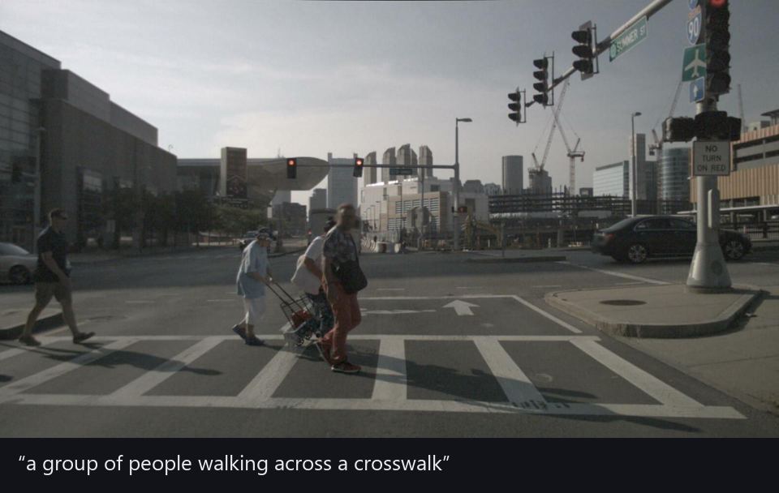

# vlm-project



## Abstract

`vlm-project` is an app that turns driving footage into a **searchable database of scene descriptions**. Simply point it at a source (the nuScenes driving dataset, a folder of images, or video files) and it captions a representative frame of each clip with a vision-language model, storing every description in a local
SQLite database with full-text search. One command ingests, another searches. It runs **fully offline on CPU** inside a container, and the database is a single portable file you can query, copy, or archive.


## Overall flow

- **Ingests** the nuScenes dataset, a folder of images, or video files (`.mp4/.mov/.avi/.mkv`), with no code change.
- **Selects** the frame(s) to describe per clip: one representative frame, a few evenly-spaced, or content-aware sub-scenes.
- **Captions** each frame with a local vision-language model: **BLIP** by default, or optional **Moondream2**. Both run offline on CPU.
- **Stores** every caption in one **SQLite file with FTS5 full-text search**, queryable by the CLI or any SQLite tool and portable as a single file.
- **Runs offline on CPU** as a batch job, no server. Two commands: `ingest` and `query` (plus `export-json` and `doctor`).

```
        your input                          vlm-project ingest
   ┌───────────────────┐              ┌──────────────────────────────┐
   │ nuScenes          │              │ 1. load clip                 │
   │ image folder      │ ───────────▶ │ 2. select keyframe(s)        │
   │ video (.mp4)      │              │      single ▸ uniform ▸ clusters
   └───────────────────┘              │ 3. caption with a local VLM  │
        (the loader)                  │      BLIP ▸ or ▸ Moondream    │
                                      └──────────────┬───────────────┘
                                                     ▼
                                         ┌───────────────────────┐
                                         │      scenes.db        │
                                         │  SQLite + full-text   │
                                         └───────────┬───────────┘
                                                     │
                            vlm-project query "pedestrian"   │   copy / ship the .db,
                                     ▼                       ▼   or export-json
                             matching scenes            keep for later
```

## Install and use

Everything runs inside one Docker container, so the only thing you install is the image, built from this
repo. Do it in order: check the prerequisites, build once, try it on your own images, then point it at
the full dataset.

### Prerequisites

- **Docker** (Docker Desktop on Windows/macOS, or Docker Engine on Linux). You build the image yourself;
  there is no prebuilt image to pull.
- **~5 GB of free disk** and **internet for the one-time build** (it downloads PyTorch and the BLIP
  weights). After that, the container runs **fully offline**, with no network or API keys.
- **CPU only**, no GPU, a few GB of RAM. No dataset or account is needed for the quick demo (step 2); the
  full nuScenes run (step 3) needs the dataset.

> **Platform notes.** On **Windows**, use PowerShell and write mounts with `${PWD}` and Windows paths, for
> example `-v ${PWD}\pics:/data:ro` (or run inside WSL2). On **Linux**, the container runs as a non-root
> user; if a run cannot write to your output folder, add `--user "$(id -u):$(id -g)"` to the `docker run`.

### 1. Build the image (once)

```bash
docker build -t vlm-project .          # a few minutes, one time
docker run --rm vlm-project doctor     # should end with "=> HEALTHY"
```

`doctor` checks the dependencies, SQLite FTS5, and that the model weights are baked in. Once it prints
`HEALTHY`, you are ready.

### 2. Try it in 30 seconds (no dataset)

Point it at a folder of your own images:

```bash
mkdir -p pics out            # drop a few .jpg / .png files into ./pics
docker run --rm -v "$PWD/pics:/data:ro" -v "$PWD/out:/out" \
  -e LOADER=imagefolder -e DATAROOT=/data -e DB=/out/demo.db vlm-project ingest -v
docker run --rm -v "$PWD/out:/out" -e DB=/out/demo.db vlm-project query car
```

Each image is captioned into `./out/demo.db` (an ordinary SQLite file), and `query` searches those
captions. That is the whole tool: `ingest` fills the database, `query` reads it.

### 3. Full run on nuScenes

Download **nuScenes v1.0-mini** (~4 GB, free account + EULA) and extract it so the root holds
`samples/ sweeps/ maps/ v1.0-mini/`, then swap the image folder for the dataset:

```bash
docker run --rm -v /path/to/nuscenes:/data:ro -v "$PWD/out:/out" \
  -e DATAROOT=/data -e DB=/out/scenes.db vlm-project ingest -v
docker run --rm -v "$PWD/out:/out" -e DB=/out/scenes.db vlm-project query "pedestrian crossing"
```

BLIP captions a frame in roughly 2 to 9 seconds on CPU, so the 10-scene mini set takes about 15 minutes.

### Develop locally (optional)

To run the tests or work on the code without Docker (Python >= 3.10):

```bash
pip install -e ".[dev]"     # pulls the ML stack (torch, transformers); add ".[video]" for the video loader
pytest                      # fast unit suite: no dataset, model, or network needed
```

## Configuration

Configuration is set by environment variables, or the matching CLI flag which wins. The common ones are
`LOADER`, `DATAROOT`, `SELECTOR`, `VLM_BACKEND`, and `DB` (all shown in the examples above). The full
reference, with every variable, flag, default, and its accepted values, is in
**[`docs/CONFIGURATION.md`](docs/CONFIGURATION.md)**.

## Design

The pipeline is four swappable stages (`loader → selector → backend → store`) wired by `pipeline.run()`
and assembled from config in one place (`factory.py`), so the dataset, keyframe strategy, and model are
configuration choices rather than code changes. The store is a single SQLite file with an FTS5 index
(`ingest` writes, `query` reads). Caption quality is checked two ways on real data: object-grounding
against nuScenes ground-truth boxes (`verify-accuracy`), and a COCO BLEU-4 model-sanity tripwire
(`bleu-sanity`).

The design decisions and trade-offs are in **[`docs/DESIGN.md`](docs/DESIGN.md)**; the test strategy and
coverage matrix are in **[`docs/TEST_PLAN.md`](docs/TEST_PLAN.md)**.

## Deploy

vlm-project deploys as a **stateless batch container**: push the image to a registry, then run it on
anything that runs containers, with the dataset mounted in and an output volume mounted out, passing
config as env vars. The container itself never changes; only the platform's wrapper around it does.

See **[`docs/DEPLOYMENT.md`](docs/DEPLOYMENT.md)** for the run contract, a worked cloud example, and notes
on scaling.
